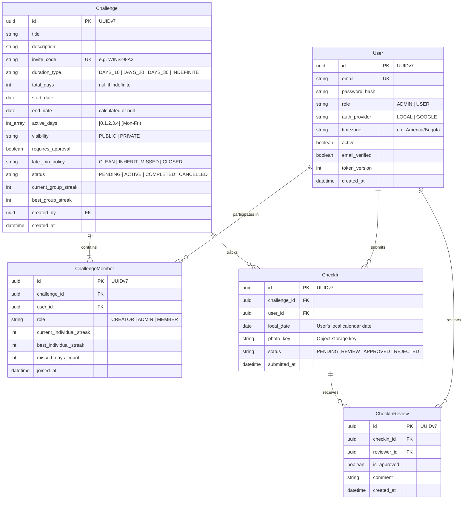

# WhoWins 🏆

> **High-stakes social accountability platform for friends and couples.** Build daily habits, upload camera-only photo proof, maintain dual group & individual streaks, and compete to see who stays disciplined the longest.

---

## 📖 Overview

**WhoWins** turns personal discipline into a collaborative yet competitive team game. Groups of friends or couples commit to a shared goal (e.g., *Gym at 6 AM*, *Read 30 minutes*, *10,000 steps*). 

Every active day, each member must capture and upload real-time photo proof (no gallery uploads). A single slip-up from any member resets the collective team streak to zero, while individual consistency is rewarded. At the end of the challenge, the member who missed the fewest days is crowned the winner!

---

## ✨ Key Features

- 👥 **Group Challenges & Invite Codes:**
  - Create custom challenges for couples ($N = 2$) or friend groups ($N \ge 2$).
  - Simple onboarding via auto-generated, shareable invite codes (e.g., `WINS-8K92`).
  - Customizable duration: **10 days**, **20 days**, **30 days**, or **Indefinite**.
  - Blacklist / Rest Days: Define active days (e.g., Monday to Friday), allowing designated rest days without breaking streaks.

- 📸 **Camera-Only Check-ins (Zero Gallery Access):**
  - Proof must be captured live from the camera.
  - **Multiple photos per day:** Members can submit multiple check-in photos throughout an active day. A day counts as completed as long as at least one photo is accepted.
  - **Presigned Direct Uploads:** Client devices upload media directly to MinIO / S3 object storage via presigned URLs. Binary payloads never pass through the FastAPI application server, keeping backend memory usage and network overhead near zero.

- 🔥 **Dual Streak Architecture:**
  - **Group Streak (All-or-Nothing):** Shared by all members. If even **one** member fails to submit proof on an active day, the group streak resets to zero.
  - **Individual Streak:** Tracks personal consistency and resilience regardless of team failures.
  - **Missed Days Counter (`missed_days_count`):** Every failure increments an individual strike.

- 👑 **Who Wins? (Winner Determination):**
  - When a challenge completes or is wrapped up, members are ranked by `missed_days_count ASC` (the person who failed the least wins).
  - In case of a tie, the tie-breaker mechanism is to be defined (e.g., an interactive mini-game using the uploaded photos).

- 🕵️ **Cheating Prevention & Peer Review:**
  - Optional peer review mode: group members can review, approve, or flag submissions as fraudulent.

- 🖼️ **Victory Photo Collage:**
  - Automatically compiles all submitted proof photos into a downloadable memory collage upon challenge completion.

- 🌐 **Timezone-Aware Deadlines:**
  - Cutoff is evaluated per member's local timezone (until 11:59:59 PM local time), accommodating friends across different regions.

---

## 🛠️ Architecture & Tech Stack

```
WhoWins (Monorepo / Clean Architecture)
├── Backend (FastAPI + SQLAlchemy 2.0 Async + PostgreSQL + MinIO)
└── Frontend (React + Vite SPA / Future Kotlin Android & iOS)
```

### Core Technologies
- **Language & Runtime:** Python 3.14+, [uv](https://github.com/astral-sh/uv) package manager
- **Framework:** [FastAPI](https://fastapi.tiangolo.com/) with asynchronous route handlers
- **Database & ORM:** [PostgreSQL](https://www.postgresql.org/), [SQLAlchemy 2.0 (Asyncio)](https://docs.sqlalchemy.org/en/20/), [asyncpg](https://github.com/MagicStack/asyncpg)
- **Migrations:** [Alembic](https://alembic.sqlalchemy.org/)
- **Object Storage:** MinIO / AWS S3 / Cloudflare R2 / Supabase Storage (Presigned PUT URLs)
- **Authentication & Security:**
  - JWT Tokens with rotation (Access & Refresh tokens)
  - `token_version` tracking for instant session invalidation
  - Argon2 password hashing via `passlib`
  - Google OAuth2 integration (`authlib`)
  - Rate limiting with [SlowAPI](https://github.com/laurentS/slowapi)
- **Email:** `fastapi-mail` for password reset workflows
- **Testing:** `pytest` + `pytest-asyncio` + `httpx`

---

## 🗄️ Data Model



---

## 📡 API Overview (Planned & Existing)

### Authentication & Users
| Method | Endpoint | Description |
|---|---|---|
| `POST` | `/api/v1/auth/register` | Register new user with email & password |
| `POST` | `/api/v1/auth/login` | Authenticate and obtain JWT tokens |
| `POST` | `/api/v1/auth/refresh` | Refresh access token using refresh token |
| `POST` | `/api/v1/auth/logout` | Revoke active session |
| `POST` | `/api/v1/auth/forgot-password` | Request password reset email |
| `POST` | `/api/v1/auth/reset-password` | Confirm password reset |
| `GET` | `/api/v1/auth/google/login` | Initiate Google OAuth2 flow |
| `GET` | `/api/v1/auth/google/callback`| Handle Google OAuth2 callback |
| `GET` | `/api/v1/users/me` | Fetch authenticated user profile & timezone |
| `PATCH` | `/api/v1/users/me` | Update user settings (timezone, display name) |

### Challenges & Groups
| Method | Endpoint | Description |
|---|---|---|
| `POST` | `/api/v1/challenges` | Create a new challenge (generates invite code) |
| `POST` | `/api/v1/challenges/join` | Join a challenge via invite code |
| `GET` | `/api/v1/challenges` | List active challenges for current user |
| `GET` | `/api/v1/challenges/{id}` | Challenge dashboard, streaks & leaderboard |
| `PATCH` | `/api/v1/challenges/{id}/members/{user_id}/role` | Promote/demote members (creator/admin) |
| `DELETE` | `/api/v1/challenges/{id}/members/{user_id}` | Remove member from challenge |

### Check-ins & Media
| Method | Endpoint | Description |
|---|---|---|
| `POST` | `/api/v1/challenges/{id}/checkin/upload-url` | Generate presigned PUT URL for direct S3/MinIO upload |
| `POST` | `/api/v1/challenges/{id}/checkin/confirm` | Confirm upload, log check-in & update streaks |
| `GET` | `/api/v1/challenges/{id}/checkin/today` | Status of today's submissions for all group members |
| `POST` | `/api/v1/checkins/{checkin_id}/review` | Peer review photo (approve/reject) |
| `GET` | `/api/v1/challenges/{id}/collage` | Download photo collage upon challenge completion |

---

## 🚀 Local Development Setup

### Prerequisites
- Python `>= 3.14`
- [uv](https://github.com/astral-sh/uv) (recommended) or `pip`
- PostgreSQL instance running locally or via Docker
- MinIO instance running locally or S3 bucket credentials

### 1. Clone & Environment Configuration
```bash
git clone https://github.com/jcamilodev-py/WhoWins.git
cd WhoWins

# Copy environment variables template
cp .env.example .env
```

### 2. Install Dependencies
```bash
# Using uv
uv sync
```

### 3. Run Database Migrations
```bash
uv run alembic upgrade head
```

### 4. Create an Initial Admin (Optional CLI)
```bash
uv run python scripts/create_admin.py --email admin@whowins.local --password AdminPassword123
```

### 5. Start Development Server
```bash
uv run uvicorn app.main:app --reload
```
Interactive Swagger documentation will be available at: `http://localhost:8000/docs`

### 6. Run Test Suite
```bash
uv run pytest
```

---

## 🗺️ Roadmap

- [x] Base User Authentication (Local Argon2 + Google OAuth2 + JWT)
- [x] Session revocation, token versioning & password reset via email
- [x] Role-Based Access Control (Admin / User) & Rate Limiting
- [ ] User Profile & Timezone management (`/api/v1/users/me`)
- [ ] Challenge & Group Membership module with dynamic invite codes
- [ ] MinIO / S3 Presigned URL storage integration
- [ ] Daily Check-in submission & validation engine
- [ ] Dual Streak Calculator (Group reset + Individual preservation)
- [ ] Challenge Completion & Winner determination logic
- [ ] Victory Photo Collage generator
- [ ] React + Vite Web Application
- [ ] Push notifications & Native Mobile App (Kotlin)
