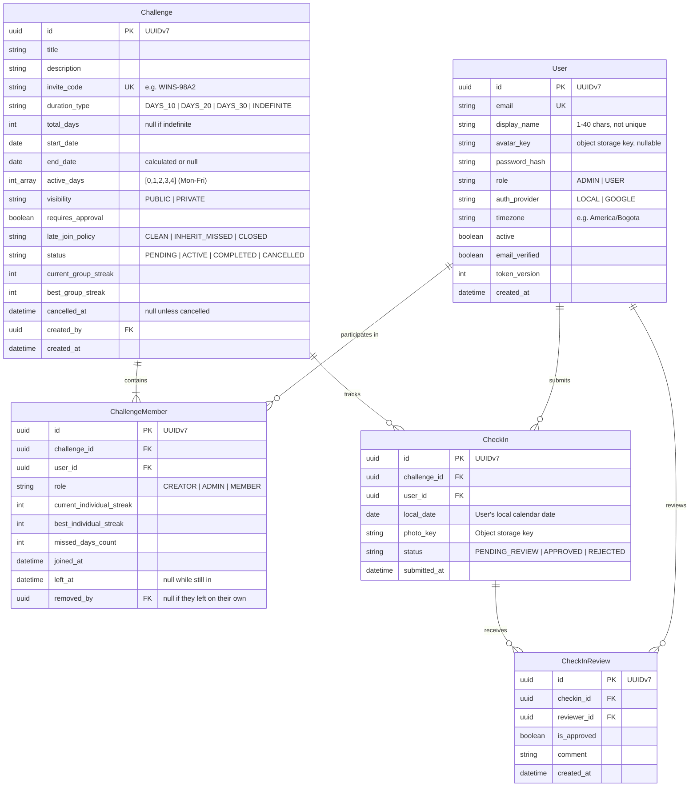

# WhoWins 🏆

> **High-stakes social accountability platform for friends and couples.** Build daily habits, upload camera-only photo proof, maintain dual group & individual streaks, and compete to see who stays disciplined the longest.

---

## 📖 Overview

**WhoWins** turns personal discipline into a collaborative yet competitive team game. Groups of friends or couples commit to a shared goal (e.g., *Gym at 6 AM*, *Read 30 minutes*, *10,000 steps*). 

Every active day, each member must capture and upload real-time photo proof (no gallery uploads). A single slip-up from any member resets the collective team streak to zero, while individual consistency is rewarded. At the end of the challenge, the member who missed the fewest days is crowned the winner!

---

## ✨ Key Features

- 👥 **Group Challenges & Invite Codes:**
  - Create custom challenges for couples ($N = 2$) or friend groups ($N \ge 2$).
  - Simple onboarding via auto-generated, shareable invite codes (e.g., `WINS-8K92`).
  - Customizable duration: **10 days**, **20 days**, **30 days**, or **Indefinite**.
  - Blacklist / Rest Days: Define active days (e.g., Monday to Friday), allowing designated rest days without breaking streaks.
  - **Leaving and cancelling:** members can leave and the creator can remove them. The days they lived stay in the history, and from the day they leave the group streak no longer depends on them. There is no way back in. The creator can also cancel the challenge, which freezes every streak as it stood at that moment.

- 📸 **Camera-Only Check-ins (Zero Gallery Access):**
  - Proof must be captured live from the camera.
  - **Multiple photos per day:** Members can submit multiple check-in photos throughout an active day. A day counts as completed as long as at least one photo is accepted.
  - **Presigned Direct Uploads:** Client devices upload media directly to MinIO / S3 object storage via presigned URLs. Binary payloads never pass through the FastAPI application server, keeping backend memory usage and network overhead near zero.

- 🔥 **Dual Streak Architecture:**
  - **Group Streak (All-or-Nothing):** Shared by all members. If even **one** member fails to submit proof on an active day, the group streak resets to zero.
  - **Individual Streak:** Tracks personal consistency and resilience regardless of team failures.
  - **Missed Days Counter (`missed_days_count`):** Every failure increments an individual strike.

- 👑 **Who Wins? (Winner Determination):**
  - When a challenge completes or is wrapped up, members are ranked by `missed_days_count ASC` (the person who failed the least wins).
  - In case of a tie, the tie-breaker mechanism is to be defined (e.g., an interactive mini-game using the uploaded photos).

- 🕵️ **Cheating Prevention & Peer Review:**
  - Optional peer review mode: group members can review, approve, or flag submissions as fraudulent.

- 🖼️ **Victory Photo Collage:**
  - Automatically compiles all submitted proof photos into a downloadable memory collage upon challenge completion.

- 🌐 **Timezone-Aware Deadlines:**
  - Cutoff is evaluated per member's local timezone (until 11:59:59 PM local time), accommodating friends across different regions.

---

## 🛠️ Architecture & Tech Stack

```
WhoWins (Monorepo / Clean Architecture)
├── Backend (FastAPI + SQLAlchemy 2.0 Async + PostgreSQL + MinIO)
└── Frontend (React + Vite SPA / Future Kotlin Android & iOS)
```

### Core Technologies
- **Language & Runtime:** Python 3.14+, [uv](https://github.com/astral-sh/uv) package manager
- **Framework:** [FastAPI](https://fastapi.tiangolo.com/) with asynchronous route handlers
- **Database & ORM:** [PostgreSQL](https://www.postgresql.org/), [SQLAlchemy 2.0 (Asyncio)](https://docs.sqlalchemy.org/en/20/), [asyncpg](https://github.com/MagicStack/asyncpg)
- **Migrations:** [Alembic](https://alembic.sqlalchemy.org/)
- **Object Storage:** MinIO / AWS S3 / Cloudflare R2 / Supabase Storage (Presigned PUT URLs)
- **Authentication & Security:**
  - JWT Tokens with rotation (Access & Refresh tokens)
  - `token_version` tracking for instant session invalidation
  - Argon2 password hashing via `passlib`
  - Google OAuth2 integration (`authlib`)
  - Rate limiting with [SlowAPI](https://github.com/laurentS/slowapi)
- **Email:** `fastapi-mail` for password reset workflows
- **Testing:** `pytest` + `pytest-asyncio` + `httpx`

---

## 🗄️ Data Model



---

## 📡 API Overview (Planned & Existing)

### Authentication & Users
| Method | Endpoint | Description |
|---|---|---|
| `POST` | `/api/v1/auth/register` | Register with email, password, display name and (optionally) IANA timezone |
| `POST` | `/api/v1/auth/login` | Authenticate and obtain JWT tokens |
| `POST` | `/api/v1/auth/refresh` | Refresh access token using refresh token |
| `POST` | `/api/v1/auth/logout` | Revoke active session |
| `POST` | `/api/v1/auth/forgot-password` | Request password reset email |
| `POST` | `/api/v1/auth/reset-password` | Confirm password reset |
| `GET` | `/oauth2/authorization/google` | Initiate Google OAuth2 flow (full-page navigation, no `/api/v1` prefix) |
| `GET` | `/login/oauth2/code/google` | Handle Google OAuth2 callback |
| `GET` | `/api/v1/users/me` | Fetch authenticated user profile & timezone |
| `PATCH` | `/api/v1/users/me` | Update user settings (timezone, display name) |
| `POST` | `/api/v1/users/me/avatar/upload-url` | Presigned PUT URL for the profile photo (browser uploads directly) |
| `PUT` | `/api/v1/users/me/avatar` | Confirm the uploaded photo (verifies size and type) |
| `DELETE` | `/api/v1/users/me/avatar` | Remove the profile photo |

### Challenges & Groups
| Method | Endpoint | Description |
|---|---|---|
| `POST` | `/api/v1/challenges` | Create a new challenge (generates invite code) |
| `POST` | `/api/v1/challenges/preview` | Preview a challenge by invite code before joining (join status, inherited missed days) |
| `POST` | `/api/v1/challenges/join` | Join a challenge via invite code |
| `GET` | `/api/v1/challenges` | List active challenges for current user |
| `GET` | `/api/v1/challenges/{id}` | Challenge dashboard: streaks, leaderboard with photos, and who last broke the group streak |
| `GET` | `/api/v1/challenges/{id}/history` | Day-by-day outcome per member, for the heatmap (`?days=`, 1–366, default 60) |
| `POST` | `/api/v1/challenges/{id}/leave` | Leave a challenge (any member but the creator; no way back in) |
| `DELETE` | `/api/v1/challenges/{id}/members/{user_id}` | Remove a member (creator only) |
| `POST` | `/api/v1/challenges/{id}/cancel` | Cancel a challenge (creator only, irreversible; streaks freeze) |
| `PATCH` | `/api/v1/challenges/{id}/members/{user_id}/role` | *Planned:* promote/demote members (creator/admin) |

### Check-ins & Media
| Method | Endpoint | Description |
|---|---|---|
| `POST` | `/api/v1/challenges/{id}/checkins/upload-url` | Presigned PUT URL for the daily proof (direct upload) |
| `POST` | `/api/v1/challenges/{id}/checkins/confirm` | Confirm the upload and record the check-in |
| `GET` | `/api/v1/challenges/{id}/checkins/today` | Today's status for every member, each on their own calendar day |
| `GET` | `/api/v1/challenges/{id}/checkins/pending` | Proofs still waiting for the group's vote |
| `PUT` | `/api/v1/challenges/{id}/checkins/{checkin_id}/review` | Cast or change a vote (majority of the other members; a tie approves) |
| `GET` | `/api/v1/challenges/{id}/collage` | *Planned:* photo collage upon challenge completion |

### Object storage in production

The browser uploads photos **straight to the bucket** with a presigned PUT, from the frontend's origin. Locally MinIO answers CORS for any origin by default, so nothing needs configuring. On S3, R2 or Supabase Storage the bucket needs an explicit CORS rule, or every upload fails in the browser while working from curl:

```json
[{"AllowedOrigins": ["https://app.example.com"], "AllowedMethods": ["PUT", "GET"], "AllowedHeaders": ["content-type"]}]
```

`AllowedOrigins` is the frontend's URL, the page the upload starts from.

---

## 🚀 Local Development Setup

### Prerequisites
- Python `>= 3.14`
- [uv](https://github.com/astral-sh/uv) (recommended) or `pip`
- PostgreSQL instance running locally or via Docker
- MinIO instance running locally or S3 bucket credentials

### 1. Clone & Environment Configuration
```bash
git clone https://github.com/jcamilodev-py/WhoWins.git
cd WhoWins

# Copy environment variables template
cp .env.example .env
```

### 2. Install Dependencies
```bash
# Using uv
uv sync
```

### 3. Run Database Migrations
```bash
uv run alembic upgrade head
```

### 4. Create an Initial Admin (Optional CLI)
```bash
uv run python scripts/create_admin.py --email admin@whowins.local --password AdminPassword123
```

### 5. Start Development Server
```bash
uv run uvicorn app.main:app --reload
```
Interactive Swagger documentation will be available at: `http://localhost:8000/docs` (development only: any other `ENV` hides it)

### 6. Run Test Suite
```bash
uv run pytest
```

---

## ☁️ Deploying to Render

The repository ships a `Dockerfile` and a Blueprint (`render.yaml`) for the API and its Postgres database, both on the free plan. The frontend is deployed separately, as a Render Static Site.

### How the pieces fit

```
browser ──> frontend static site (e.g. https://whowins.onrender.com)
              ├── /api/*, /oauth2/*, /login/oauth2/*  ── rewrite ──> API (https://whowins-api.onrender.com)
              └── everything else                      ──> the SPA
browser ──> bucket (e.g. Cloudflare R2), directly, for photos
```

`onrender.com` is on the [Public Suffix List](https://publicsuffix.org/), so two `*.onrender.com` services are two different **sites**, and the `SameSite=Lax` session cookies never travel from one to the other. The frontend therefore proxies the API with rewrite rules: the browser only ever talks to one origin, and the cookies stay first-party. With a custom domain later (`app.` and `api.` under one domain), the proxy becomes optional.

### Steps

1. **Bucket.** Render has no object storage, so photos need an S3-compatible bucket elsewhere. Cloudflare R2's free tier fits: create a bucket and an API token with object read and write access, then add the CORS rule from [Object storage in production](#object-storage-in-production) with the frontend's URL. The endpoint is `https://<account-id>.r2.cloudflarestorage.com` and the region `auto`.
2. **Google.** In the Google Cloud console, add `https://<frontend>/login/oauth2/code/google` as an authorized redirect URI. It is the frontend's address, not the API's: the callback comes back through the proxy.
3. **Blueprint.** In the Render dashboard, *New → Blueprint*, then pick this repository. Render generates `JWT_SECRET` and `SESSION_SECRET` and wires the `DB_*` values to the database. It asks for the rest:

   | Variable | Value |
   |---|---|
   | `FRONTEND_URL`, `CORS_ALLOWED_ORIGINS`, `OAUTH_REDIRECT_BASE_URL` | The frontend's URL, all three the same, e.g. `https://whowins.onrender.com` |
   | `GOOGLE_CLIENT_ID`, `GOOGLE_CLIENT_SECRET` | From the Google Cloud console |
   | `STORAGE_ENDPOINT_URL`, `STORAGE_ACCESS_KEY`, `STORAGE_SECRET_KEY`, `STORAGE_BUCKET`, `STORAGE_REGION` | From the bucket (`auto` is R2's region) |

4. **Frontend.** Create a Static Site from the frontend repository, built with `VITE_API_URL` **empty** so it calls its own origin. Add these rewrite rules, in this order:

   | Source | Destination | Action |
   |---|---|---|
   | `/api/*` | `https://whowins-api.onrender.com/api/*` | Rewrite |
   | `/oauth2/*` | `https://whowins-api.onrender.com/oauth2/*` | Rewrite |
   | `/login/oauth2/*` | `https://whowins-api.onrender.com/login/oauth2/*` | Rewrite |
   | `/*` | `/index.html` | Rewrite |

5. **Check.** `https://whowins-api.onrender.com/health` answers `{"status": "ok"}`. Then log in through the frontend and open a page that needs the session. Render documents that a rewrite can target another URL, but not how it treats cookies: if the login succeeds and the next request is a 401, the proxy is dropping them, and the way out is a custom domain or a small proxy service in front of the frontend.

### What the service does on its own

- Runs the migrations on every start, because Render's pre-deploy command is only available on paid instances. Then it serves on `$PORT`.
- Refuses to start with `ENV=production` while any value is still a development default, and lists every one of them in the deploy log.
- Hides `/docs` and `/openapi.json`.
- Trusts the proxy's `X-Forwarded-*` headers, so the rate limits count each client rather than Render's proxy.
- Runs a single process, because the rate limits live in its memory. More than one instance needs `RATE_LIMIT_STORAGE_URI` pointing to Redis.
- Deploys only commits whose GitHub checks passed (`autoDeployTrigger: checksPass`). CI builds the same Docker image.

### Free plan limits

| Limit | Consequence | Way out |
|---|---|---|
| The service sleeps after 15 minutes without traffic | The first request afterwards takes about a minute | A paid instance |
| Free Postgres **expires 30 days** after creation | The data is deleted after a 14-day grace period | Upgrade the database, or use an external free Postgres such as Neon: set the `DB_*` variables by hand, with `DB_SSL=true` |
| Outbound SMTP (ports 25, 465 and 587) is blocked | Password reset emails are never sent | A paid instance, or an email provider with an HTTP API (not built yet) |

---

## 🗺️ Roadmap

- [x] Base User Authentication (Local Argon2 + Google OAuth2 + JWT)
- [x] Session revocation, token versioning & password reset via email
- [x] Role-Based Access Control (Admin / User) & Rate Limiting
- [x] User Profile & Timezone management (`/api/v1/users/me`)
- [x] Challenge & Group Membership module with dynamic invite codes
- [x] MinIO / S3 Presigned URL storage integration
- [x] Daily Check-in submission & peer review
- [x] Dual Streak Calculator (Group reset + Individual preservation)
- [ ] Challenge Completion & Winner determination logic
- [ ] Victory Photo Collage generator
- [ ] React + Vite Web Application
- [ ] Push notifications & Native Mobile App (Kotlin)
